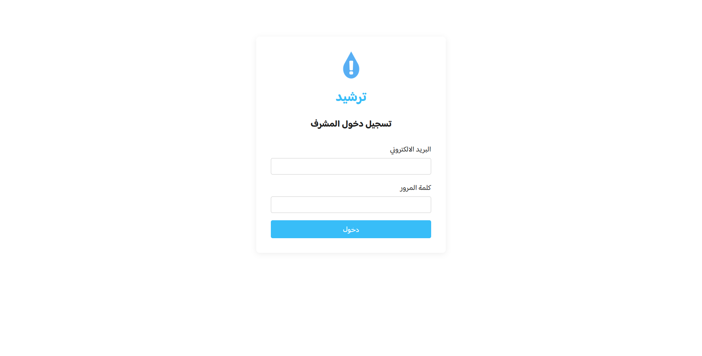
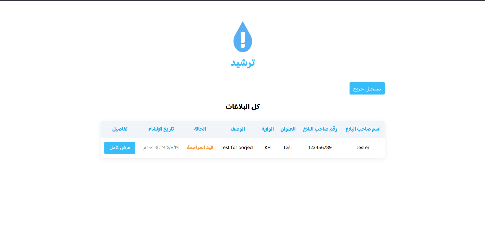
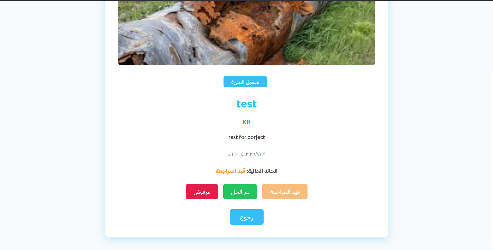
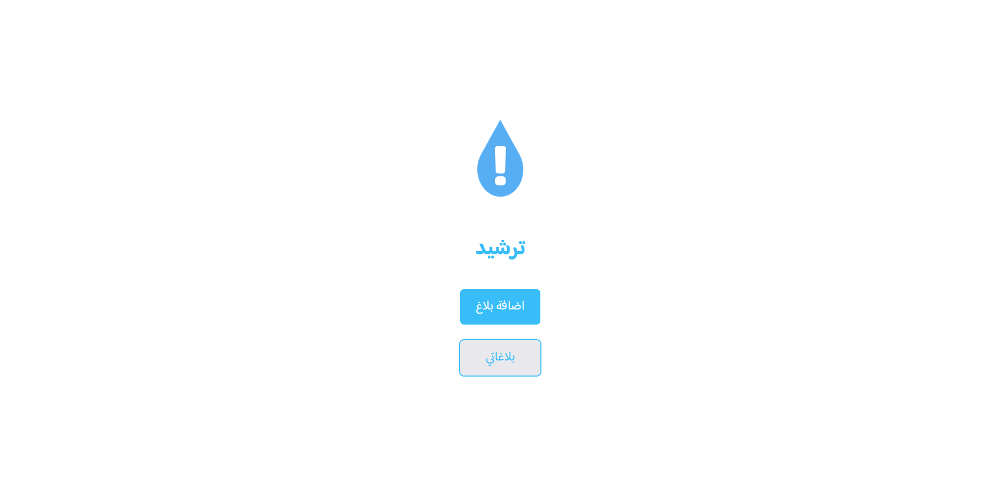
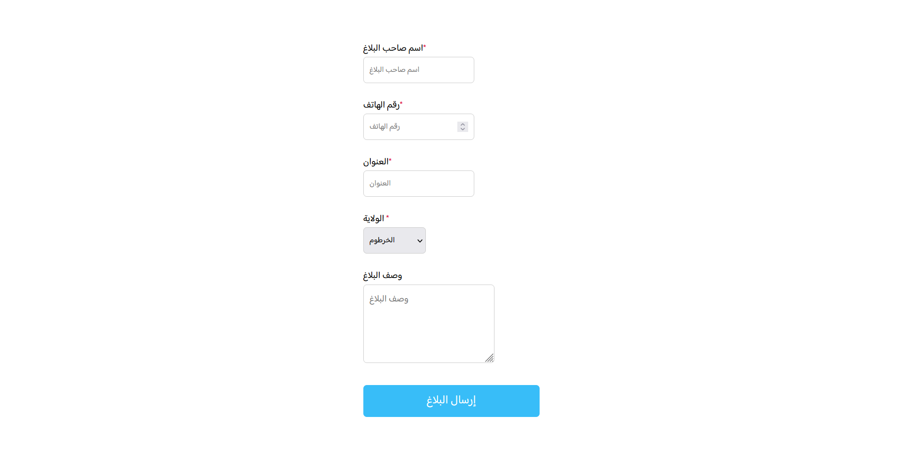
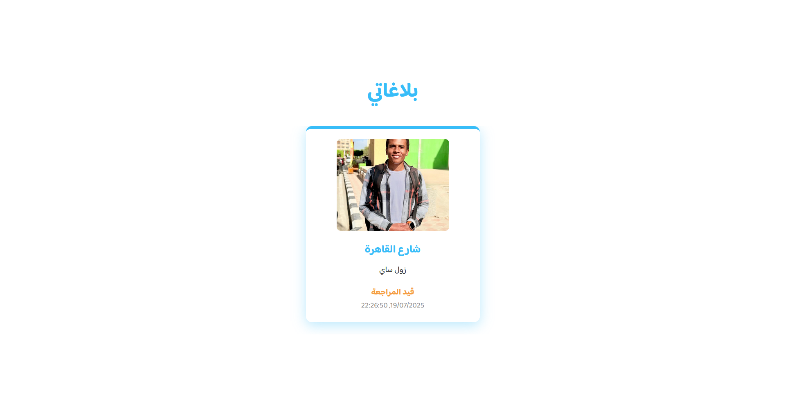

# ترشيد (Tarsheed)

تطبيق ترشيد هو نظام بلاغات إلكتروني يتيح للمستخدمين إرسال بلاغات حول مشاكل أو اقتراحات في مناطقهم، ويتيح للمشرفين إدارة ومتابعة هذه البلاغات.

<div style="display: grid; grid-template-columns: 1fr 1fr 1fr; gap: 10px;">
  
  
  
  
  
  
</div>

## المميزات

- إرسال بلاغ جديد مع صورة ووصف وحالة.
- عرض جميع البلاغات الخاصة بالمستخدم.
- عرض تفاصيل البلاغ مع إمكانية حذف البلاغ.
- لوحة تحكم للمشرفين لعرض جميع البلاغات وتغيير حالتها (قيد المراجعة، تم الحل، مرفوض).
- تسجيل دخول للمشرفين.
- واجهة مستخدم بسيطة وسهلة الاستخدام.
- امان البيانات وحمايتها.

## (MERN) التقنيات المستخدمة

- **Frontend:** React, CSS Modules
- **Backend:** Node.js, Express, MongoDB (Mongoose)
- **التوثيق:** LocalStorage للمستخدمين، تسجيل دخول للمشرفين

## طريقة التشغيل

1. **تشغيل الخادم الخلفي:**
   ```sh
   cd backend
   npm install
   npm start
   ```
2. **تشغيل واجهة المستخدم:**
   ```sh
   cd tarsheed-app
   npm install
   npm start
   ```
3. **تشغيل لوحة المشرف:**
   ```sh
   cd tarsheed-admin
   npm install
   npm start
   ```
4. **docker التشغيل عن طريق**
   ```sh
   docker-compose up -d  # بناء وتشغيل الخدمات  
   ```
5. **إيقاف الخدمات:**
   إذا كنت تستخدم Docker، يمكنك إيقاف الخدمات باستخدام:
   ```sh
   docker-compose down  # إيقاف الخدمات
   ```


## إعداد قاعدة البيانات

تأكد من وجود MongoDB على جهازك أو استخدم خدمة MongoDB Atlas.  

## المجلدات

- `backend/` : كود الخادم وواجهات API
- `tarsheed-app/` : واجهة المستخدم الرئيسية
- `tarsheed-admin/` : لوحة تحكم المشرفين

## المساهمة

للمساهمة في المشروع، يرجى فتح طلب سحب (Pull Request) أو التواصل عبر البريد الإلكتروني.

---

**ترشيد - منصة البلاغات الذكية**